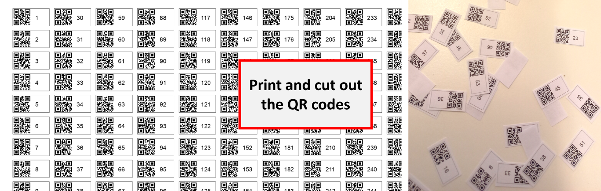

 
When capturing an organism using digital imaging we often need to connect information on the specimen, i.e., where, when and how it was captured, with phenotypic or taxonomic information, i.e., body size or species name. Most scientists do this via unique ID tags; short alphanumeric sequences printed on white paper or plastic that are included with the specimen inside the image. However, while recognizing the tag inside the image, and extracting the information might be a simple task for a human (that is, if the code is short enough and of sufficient size), it's much harder for computer vision (CV) algorithms. 
 

 
The task of detecting alphanumeric characters in images is referred to as optical character recognition (OCR), and while there are some good OCR-engines out there (e.g., [tesseract](https://github.com/tesseract-ocr/tesseract)), [QR codes](https://en.wikipedia.org/wiki/QR_code) represent a much better way for automatic text extraction from images. QR codes with their [position and alignment patterns](https://commons.wikimedia.org/wiki/File:QR_Code_Structure_Example_3.svg#/media/File:QR_Code_Structure_Example_3.svg) are much more easily recognizable by CV algorithms than plain text, which can come in any form or structure. Moreover, QR codes can store more than enough information for basic ID tagging purposes (e.g., even the micro variant can store [up to 35 numeric characters](https://en.wikipedia.org/wiki/QR_code#Micro_QR_code). 
 

Try the gist at the bottom of this post to produce hundreds of small QR codes in Python for your next field survey or lab experiment. Naturally, the little tags also include human readable version of the text you wish to encode. The Python-code can be easily modified to also include letters, symbols, etc. - if you have questions or need help feel free to contact me. You can [download a sample batch of QR codes here](QR_codes_1-319.pdf).

GitHub gist to produce QR codes in Python:

