 
When working with organisms during field surveys or experiments we often need to take images of all used specimens for downstream analyses and phenotyping. Specifically when working with invertebrates, this can mean photographing hundreds or even thousands of specimens within a short period. Here I present the imaging methods I developed during my PhD to phenotype thousands of aquatic isopods (*Asellus aquaticus*) - both alive and preserved. I conceived these approaches for aquatic organisms, but I'm convinced they could be easily applied for terrestrial samples as well. 
 
 

	

		

		
		

	
		

		<a href="photographed2.jpg" data-lightbox="about" data-title="Asellus aquaticus (live specimens), photographed from a camera stand using the default lens (image downsized for website).">
		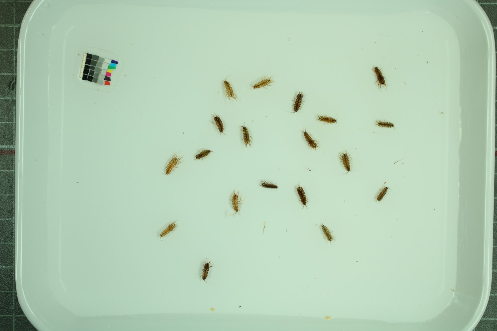</a>
		

		

		<a href="scanned1.jpg" data-lightbox="about" data-title="Asellus aquaticus (preserved specimens), scanned with a modified flatbed scanner (image downsized for website).">
		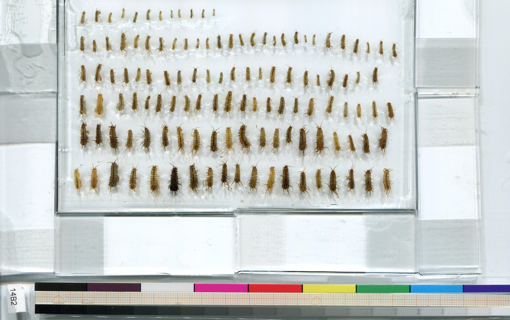</a>
		

	

 
Also see my post on  [best practices for standardizing scientific images]() and on [how to create color and size reference cards](). 
 
## 1 - Camera stand (suitable for live organisms)

The basic principle of this method is to install a camera on a camera-stand ("Reprostativ" in German == reprographic stand) where distance to the specimen can easily be adjusted and suitable lighting be easily installed - two major advantages over working with a tripod. Keep in mind that when you adjust camera distance or lighting this may affect the data that is extracted from the images later on, specifically, pixel-to-mm-ratio and brightness/darkness. If this varies from image to image, you should include [reference cards]() in every image. I used a ring-light when photographing small specimens with the macro lens, and LED panels when taking pictures of whole trays with the regular lens. 

What you need:
- camera stand - I used one by [Kaiser](https://www.kaiser-fototechnik.de/en/produkte/artikel.php?document=/en/produkte/2_1_produktanzeige.asp&display=1&nr=5510)
- DLSR or mirrorless camera that take macro-lenses - I used an EOS 750D by canon, but today I would use a mirrorless model such as the [EOS R50](https://store.canon.se/canon-eos-r50-mirrorless-camera-body-black/5811C030/)
- macro lens for tiny specimens - I used a [70-300 mm lens by Tamron](https://www.fotosidan.se/prylar/objektiv/zoomobjektiv/tamron/tamron-af-70-300mm-f-4_12894)
- LED ring light and/or LED panels for lighting - I got both, some relatively cheap ones from AliExpress 
- suitable tray with homogeneous background - I used [MF-resin trays](https://www.chemoline.at/laborartikel_aus_kunststoff_gummi_kork/instrumentenschalen_aus_melamin-formaldehyd-harz.html) which have an extremely smooth white surface that is very color-stable
- computer for camera control
- light diffusors (optional) 

	

		

		<a href="camera_stand1.jpg" data-lightbox="about">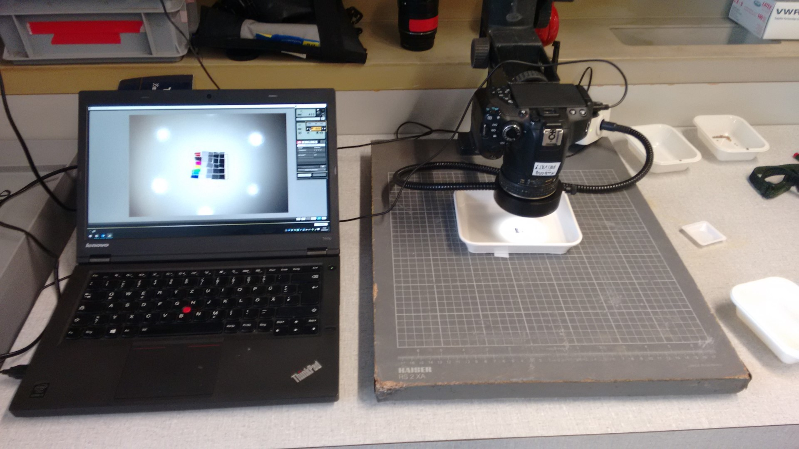</a>
		

	
		

		<a href="camera_stand2.jpg" data-lightbox="about">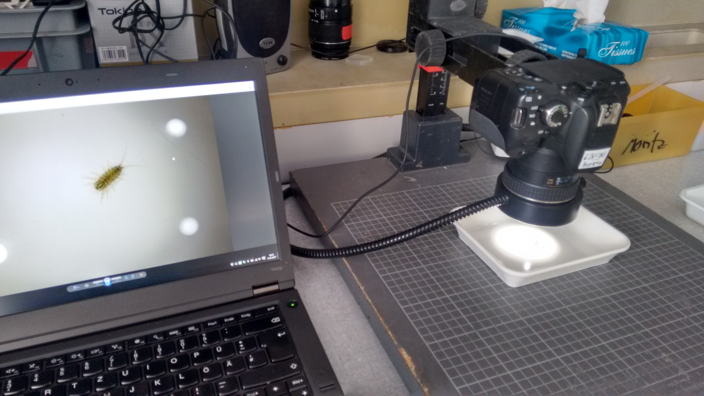</a>
		

		

		<a href="camera_stand3.jpg" data-lightbox="about">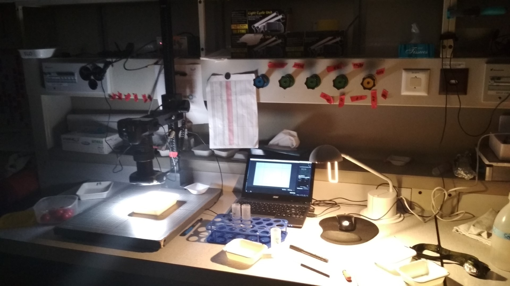</a>
		

		
		

		<a href="camera_stand4.jpg" data-lightbox="about">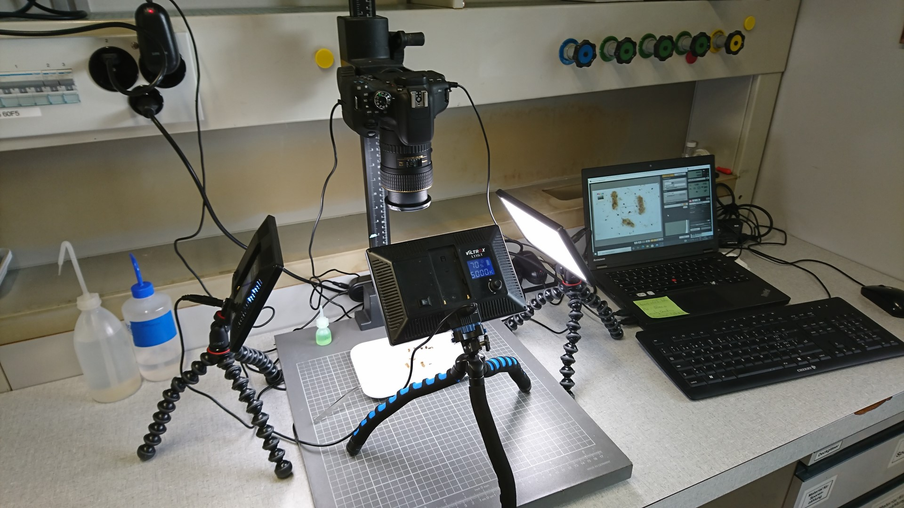</a>
		

	
		

		<a href="camera_stand5.jpg" data-lightbox="about">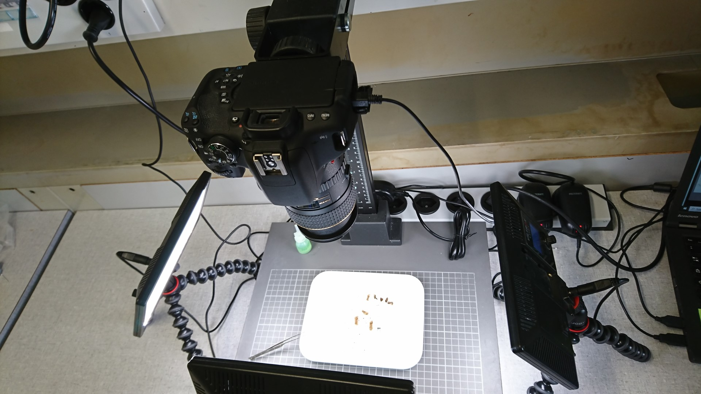</a>
		

		

		<a href="camera_stand6.jpg" data-lightbox="about">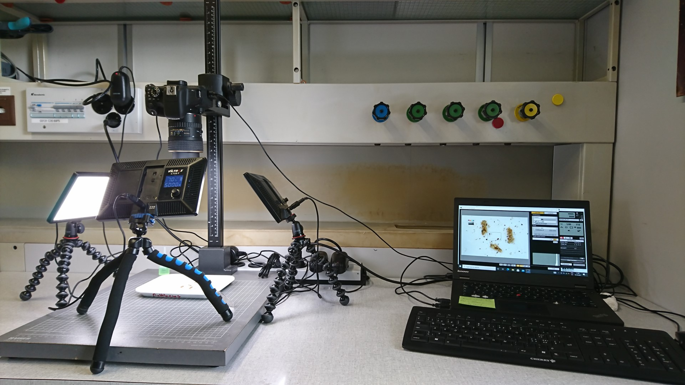</a>
		

	

## 2 - Modified flatbed scanner (best for dead/preserved specimens)

Early on in my PhD, I modified a document flatbed scanner to be able to receive wet samples, i.e., preserved isopods laying on their back and fully immersed in water. This was to avoid any reflections, which is an issue when working with aquatic organisms. Specifically, I used an elastic two-component glue (food-safe silicone might also work) and then "masoned" the slides around a part of the scanner - depending on expected sample sizes you might also choose to use the whole surface. It's important that the water remains inside the slides to not damage the scanner. Since the imaging conditions of scanner remain virtually stable (i.e., identical resolution and no changes to lighting environment), you could refrain from including a reference in every single scanned image. 

What you need:

- flatbed scanner - I used an [Epson Perfection V39](https://www.epson.co.uk/en_GB/products/scanners/consumer/perfection-v39/p/14157)
- microscope slides
- two-component glue (or silicone or something with similar properties). 

	

		

		<a href="scanner1.jpg" data-lightbox="about">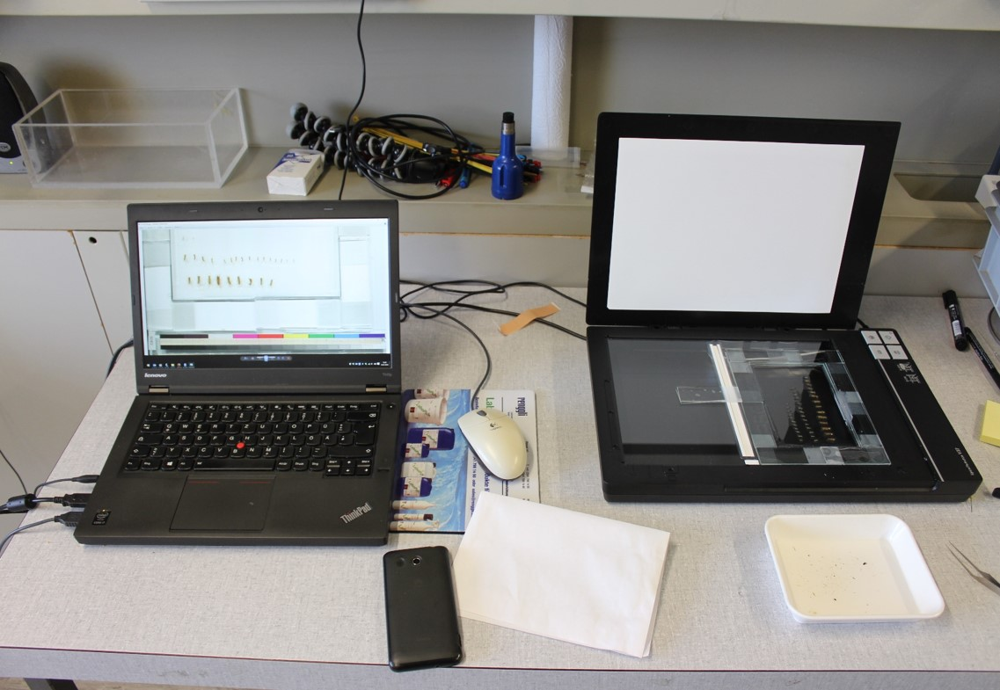</a>
		

	
		

		<a href="scanner2.jpg" data-lightbox="about">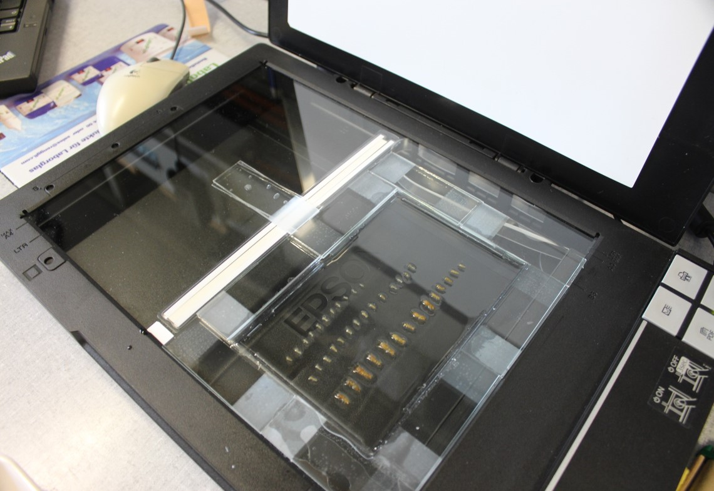</a>
		

		

		<a href="scanner3.jpg" data-lightbox="about">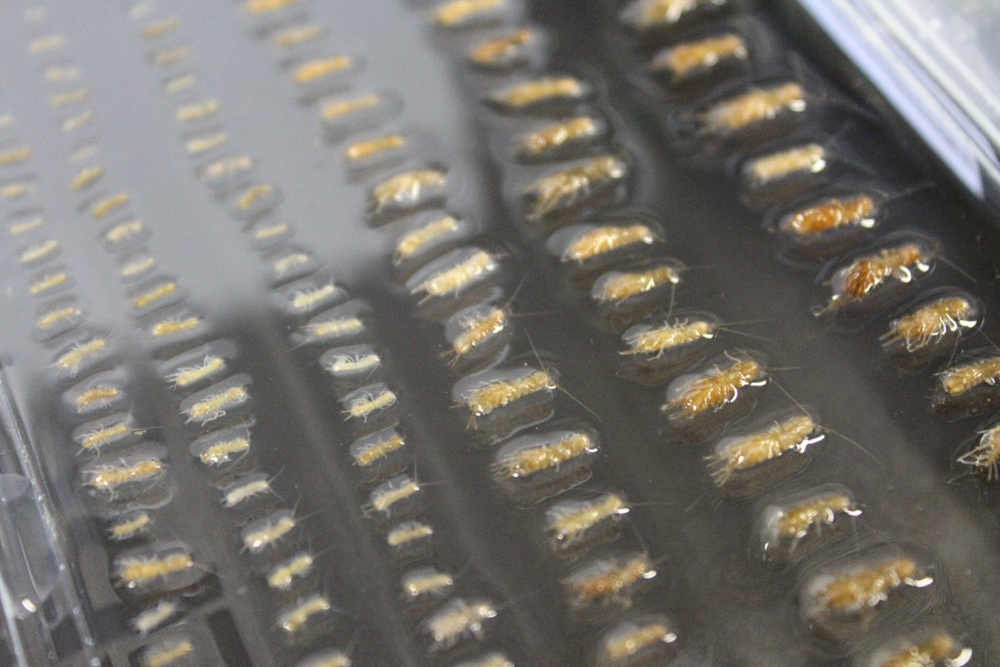</a>
		

	

