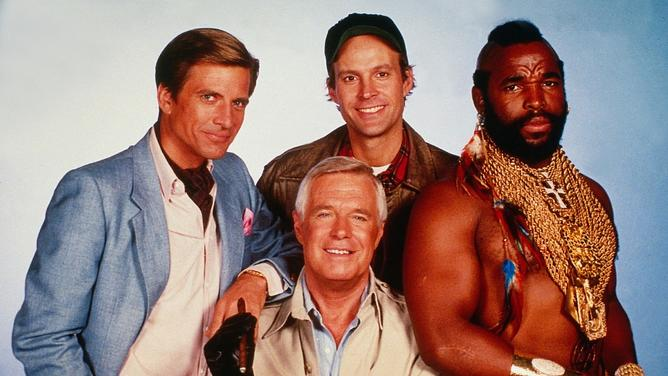

# Background 

Sometime in the spring of 2022 I had the idea of organizing a small meeting at Lund University (LU), where experienced developers of computer vision (CV) methods and practitioners from the biological domain would get together to talk to each other. This idea was motivated by several thoughts. On the one hand, at that point of time there were no dedicated CV-themed symposia or sessions at biological conferences, and it would certainly not have occurred to me to go pure CV meetings like CVPR or the like. On the other hand, already when we wrote our [review paper in 2020/2021](https://www.frontiersin.org/articles/10.3389/fevo.2021.642774/full), I realized that there is fundamental mismatch between what biologists think of CV and what applying CV on a day-to-day basis is actually about. So, overall, my thoughts were that we should have a bottom-up meeting where people can get together to chat about the topic, and listen to some exciting applications of CV that motivate to implement their workflow. There was already a critical mass of potential CV users inside our department (LU Biology is fairly large), so I thought it was just a matter of inviting some expert and getting each other to talk. It was not until receiving more funding when we decided to also open it to the broader public, and it turned into a small conference.

	 
	
 Conference website: <a href="https://cv-eeb.netlify.app/">https://cv-eeb.netlify.app/</a>

	

 

Here I want to briefly summarize how we went about to organize the [International Forum for Computer Vision in Ecology and Evolutionary Biology](https://cv-eeb.netlify.app/), hoping that it will help those interested in organizing similar events.

## The team

The very first thing I did was to ask other people whether they wanted to help me with organizing this event. This may sound trivial, but having a good team is really essential, even if, in the end, you will probably be doing most of the work. Together, we shuffled ideas and talked broadly about the scope, but also about details (room availability, timing of the event [e.g., to not overlap with teaching], catering), which turned out to be quite important in the end. 

 

We were a team of two PIs and 4 postdocs, one intern, and - really important - office support staff who helped tremendously with booking flights, organizing accommodation, and many other things. Regardless of how good your idea for an event like this is: you *need* someone like that! In retrospect, it would have been really good to get students to help us, because it is also good for them to make this experience, but this is something I did not think about at the beginning.

## Timeline 

The first idea was 1.5 years before the actual event, but the most intense period of the organization was between 6 and 1 months before, when I announced the meeting and opened the registration. **key events highlighted**:

- **2022-03: Initial idea**
- 2022-05: First meeting as a team
- **2022-06: Asked the unit head for financial support - and received it!** We were very lucky to be in a situation where the unit could offer us some basic funding (on the order of 5000$), but I had to promise that I would look for complementary funding.
- 2022-07: Make a budget, and alternative plans, contingent on funding. Calculating with the money we had at this point I contacted some 2-3 people who I thought made most sense to have. In the case of additional funding, we could then scale it up.
- 2022-10: Progress meeting after the summer to discuss opportunities for funding. 
- 2022-10: Wrote two grants to local foundations (Hans Kristiansson, Lars Hiertas - see below)
- 2022-11: Contacted local actors at LU to see how they would be able to contribute (CIPA, AI-Lund - see below)
- 2022-11: Talked to the department about the potential of paying for one of the speakers
- **2022-12: I received positive notice from the Hans Kristiansson foundation**
- 2023-01: Contacted 4 keynote speakers which we could bring in on the new funding
- 2023-01: I received positive notice from the Lars Hiertas foundation and contacted two more speakers
- 2023-01: Circulated a survey on the use of computer vision in our department to unterstand which sessions and topics make sense (the target audience at this point was still mostly the local department)
- **2023-02: Drafted a first program, and, in the following weeks, talked about it many times with the team**
- 2023-03: Speaker roster complete
- 2023-04: Website went online (hosted through github and netlify: [https://github.com/mluerig/cv-eeb](https://github.com/mluerig/cv-eeb))
- **2023-05: opened the registration and circulated the announcement for the event**
- 2023-07: Registration closed
- 2023-07/08: Created the final program, abstract booklets, sent reminder emails to participants (when details or contributions were missing) - this is when s\*\*\* really hit the fan 🙈
- **2023-09: Forum took place!**

## Funding 

To acquire funding, it was really worth thinking broadly and creatively (having a diverse team really helped there), because at LU there were already quite many different actors that would be interested in contributing to such a meeting in various ways. I would recommend doing thorough horizon scanning when you start thinking about the scope of your event, and the funding, logistics and other contributions it may require. Moreover, Swedish researchers are lucky to have access to many smaller funding agencies. I am happy to share my applications and provide additional comments - please feel free to [contact me](mailto:moritz.luerig@gmail.com)  

Who I contacted / applied for funding:
 
- Evolutionary Ecology Unit (sub-unit of the department of Biology) (5000 €)
- [Hans Kristianson Minne](https://www.staff.lu.se/research-and-education/research-support/travel-and-research-grants/other-grants-and-scholarships) (10000 €)
- [Lars Hiertas Minne](https://www.larshiertasminne.se/) (3000 €)

Other actors I contacted to discuss a financial or logistic contribution:
- [GENECO](https://www.biology.lu.se/phd-studies/geneco-graduate-research-school-genomic-ecology): paid our office support staff (~2000 €)
- Head of the department of biology: paid for a speaker (through the departmental seminar) and exempted us from the (considerable) burden of overhead at Lund (~ 800 $ and 10000 €, respectively)
- [AI Lund](https://www.ai.lu.se/start): paid for a speaker (~ 800 €)
- [CIPA](https://www.microscopy.lu.se/cipa): supported us with advertisement and PR campaigns

**In summary, we started out with roughly 5000 €, which would have been enough for a nice 1-2 day symposium, but eventually were able to get our budget up to more than 20000 €, which allowed us to scale up to a small conference.**

Funding bodies we considered, but ultimately did not apply with:

- [ESEB Progress meetings](https://eseb.org/prizes-funding/progress-meetings-in-evolutionary-biology/)
- [ESEB Special topics networks](https://eseb.org/prizes-funding/special-topic-networks/)
- [SSE International event grants](https://www.evolutionsociety.org/index.php?module=content&type=user&func=view&pid=17#events)
- Lund University main administration
- [Royal Fysiografen Society](https://www.fysiografen.se/en/grants/grants-overview/)

## Other comments
- What I thought we needed but then didn't was university support for advertisement through a university domain website. We tried it but it turned out to be rather slow and inflexible, and given how easy it is these days to [create and host websites](/posts/website-with-gh-pages/), I would suggest to do it yourself find someone who knows a bit about this and then do your own thing. 
- Use google docs to organize speaker lists, participants and schedules - they can be updated dynamically for everyone, which makes it much easier to keep track. Same goes for organizing registrations: using the official university forms and templates would have potentially been complicated, so we used google forms. Keep in mind your university data-protection policies, and inform the users if needed. 
- I would make sure to have as many breaks as possible in such an event, because that's where people interact and good stuff happens! That's why I spend a significant portion of he funding on snacks, coffee, pizza and beer, instead of bringing in more speakers. 
