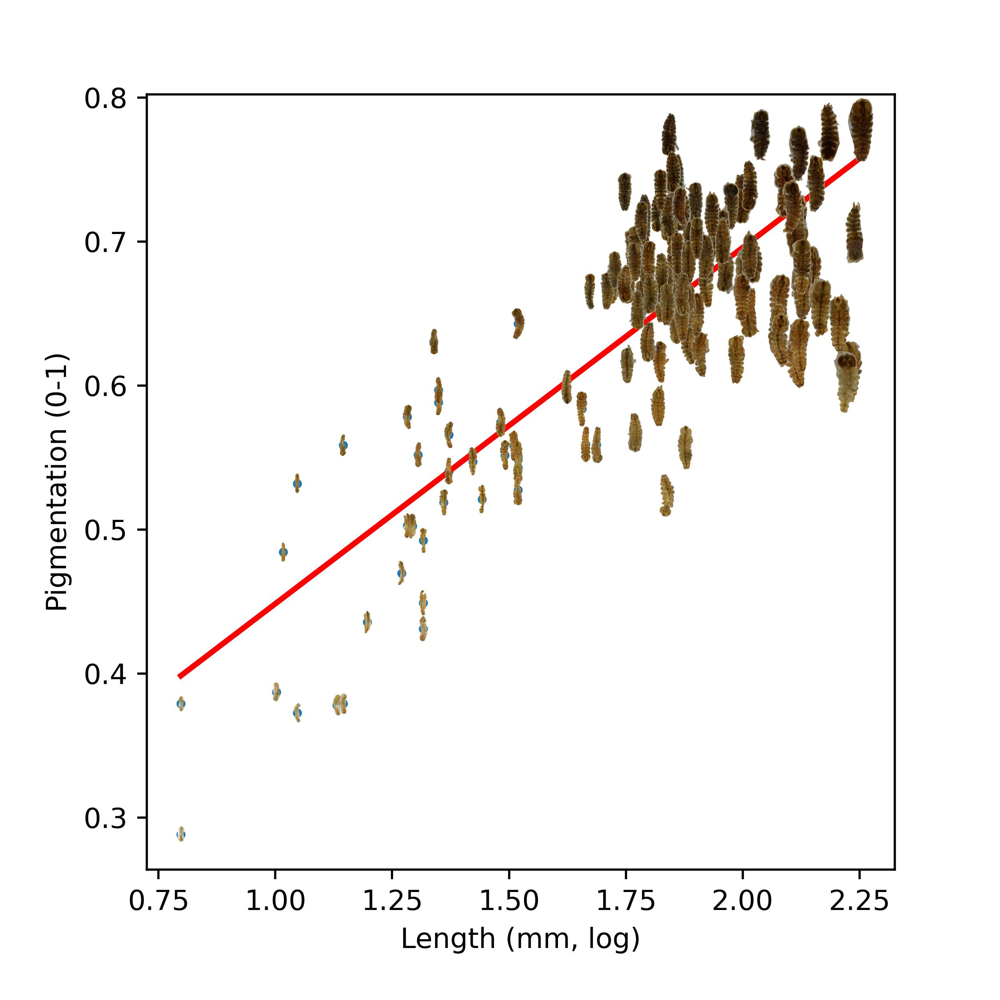

# Background 

Interpreting phenotypic variation presented through scientific figures is often challenging, because the traits of interest are hidden behind data points. Specifically in scatterplots or biplots of Principal Component Analysis (PCA), which can be highly dimensional, the visual impression often remains abstract. Using pictograms instead of data points, or adding interactive elements can be a powerful way to increase the communicative value of a figure. In this post I will show to accomplish either in Python, using matplotlib and the bokeh library. 

## Pictogram-based figure 

In this approach the goal is to plot the pictograms directly into the plot panel, which can be useful if you want to see all the variation in your dataset at once so relationships of interest become visible, or if interactive figures are not an option (e.g., in publications). This is fairly straightforward using the matplotlib library 

## Interactive figures



