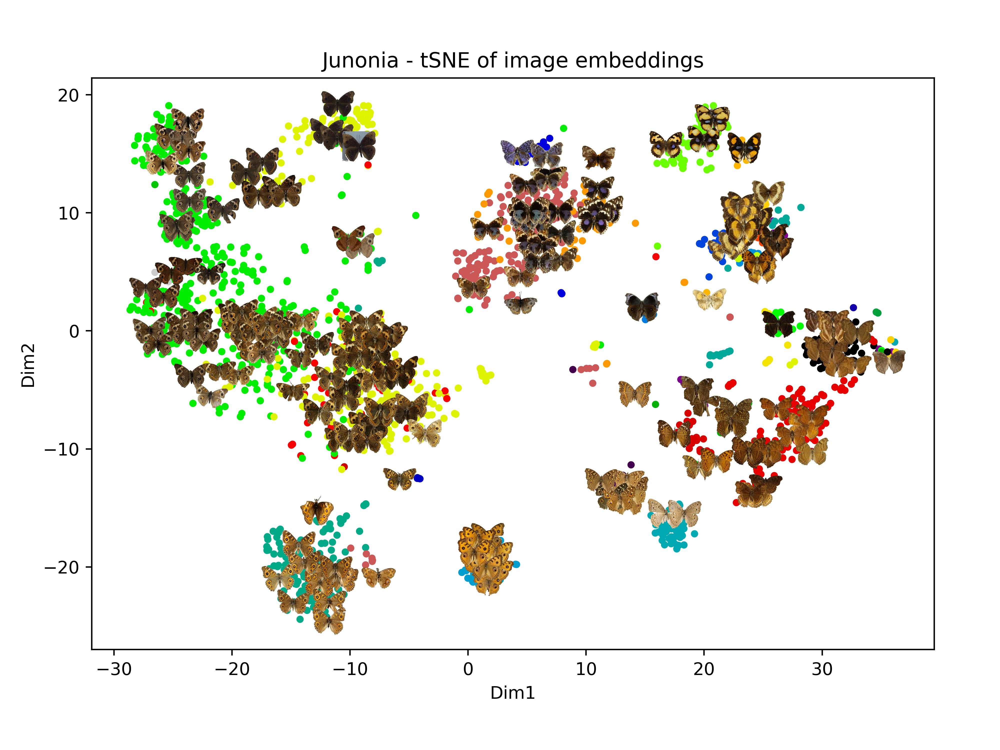
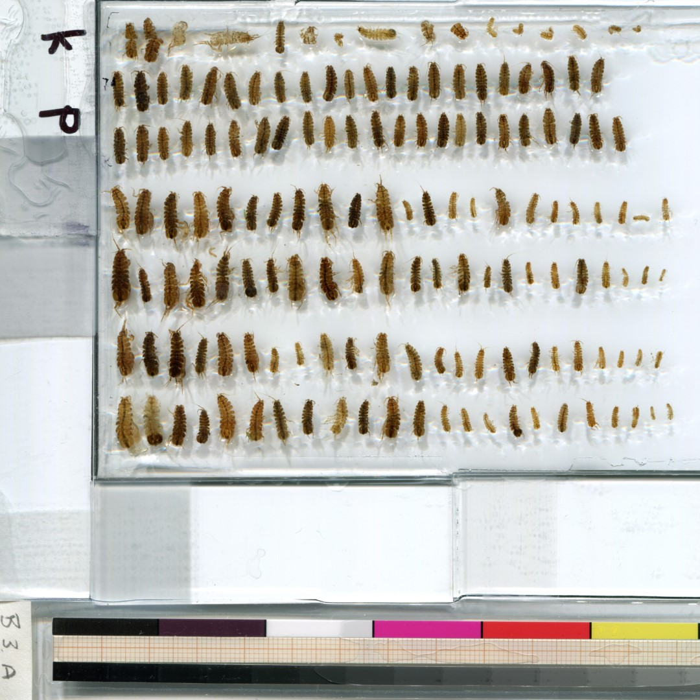
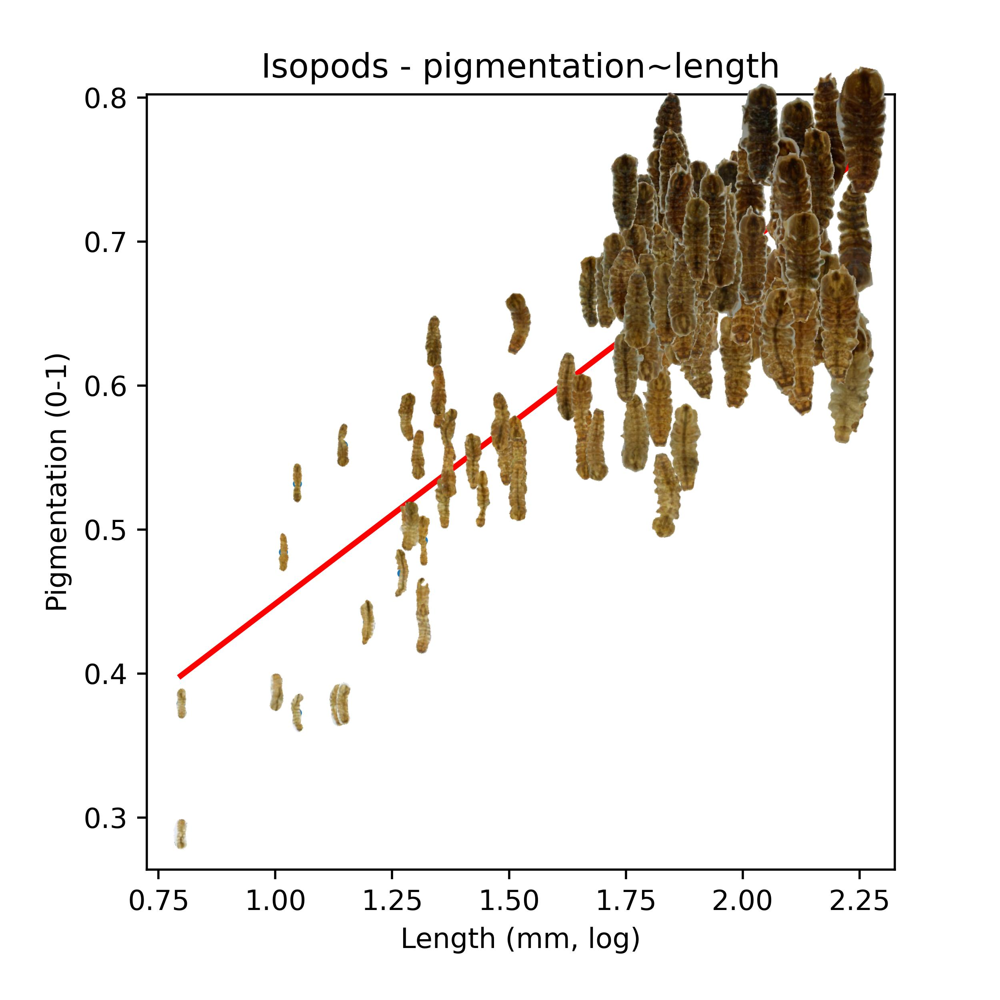

# Background 

Interpreting phenotypic variation presented through scientific figures is often challenging, because the traits of interest are hidden behind data points. Specifically in scatterplots or biplots of Principal Component Analysis (PCA), which can be highly dimensional, the visual impression often remains abstract. Using pictograms instead of data points, or adding interactive elements can be a powerful way to increase the communicative value of a figure (especially if your study organism as charismatic as these Junonia butterflies). In this post I will show to accomplish either in Python, using matplotlib and the bokeh library. 

	

	

## Pictogram-based figure 

In this approach the goal is to plot the pictograms directly into the plot panel, which can be useful if you want to see all the variation in your dataset at once so relationships of interest become visible (in this case, increasing pigmentation with body size in aquatic isopods), or if interactive figures are not an option (e.g., in publications). This is fairly straightforward using [matplotlib's offsetbox module](https://matplotlib.org/stable/api/offsetbox_api.html#matplotlib.offsetbox.OffsetImage) - see the result below:

 

	

		

		
		

	
		

		
		

	

Reproduce the figure with the following gist and by [downloading the isopod dataset and scripts](https://osf.io/download/6u5ry/).

	

## Interactive figures

The solution for producing interactive figures is a bit more involved (but not too much). Here we use [bokeh, an extremely powerful library](https://docs.bokeh.org/en/latest/docs/gallery.html) for static and interactive plots in Python. bokeh allows you to add all sorts of tools (The important step is the creation of a custom [java-based hover tool](https://docs.bokeh.org/en/latest/docs/user_guide/interaction/js_callbacks.html) to display trait information and the pictograms in a panel to the right when hovering over points on the scatter plot. The final layout, which combines the scatter plot and image display, is rendered and saved as an HTML file - give it a try by hovering over the points: 

	

		
	

Reproduce the figure with the following gist and by [downloading the isopod dataset and scripts](https://osf.io/download/6u5ry/).

	

